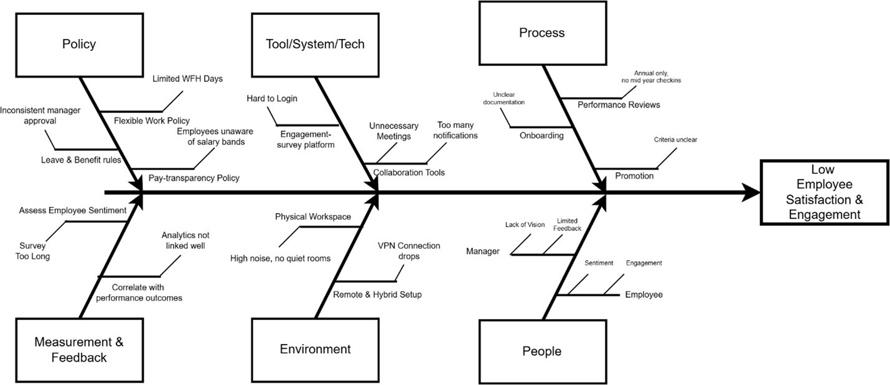
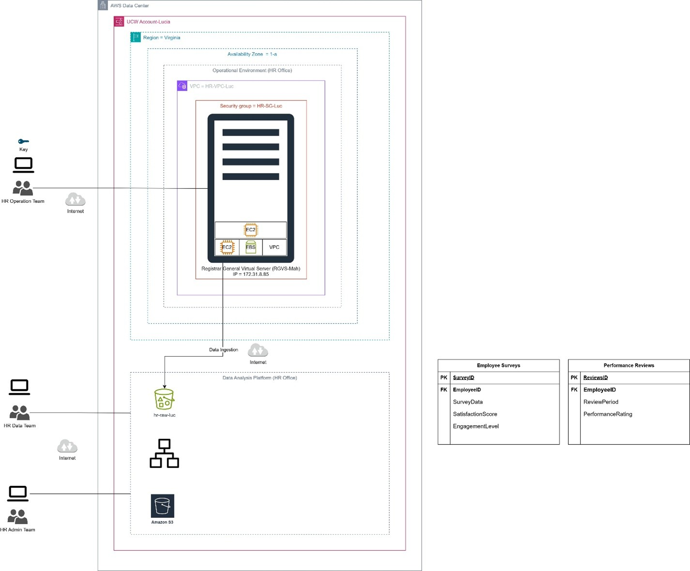
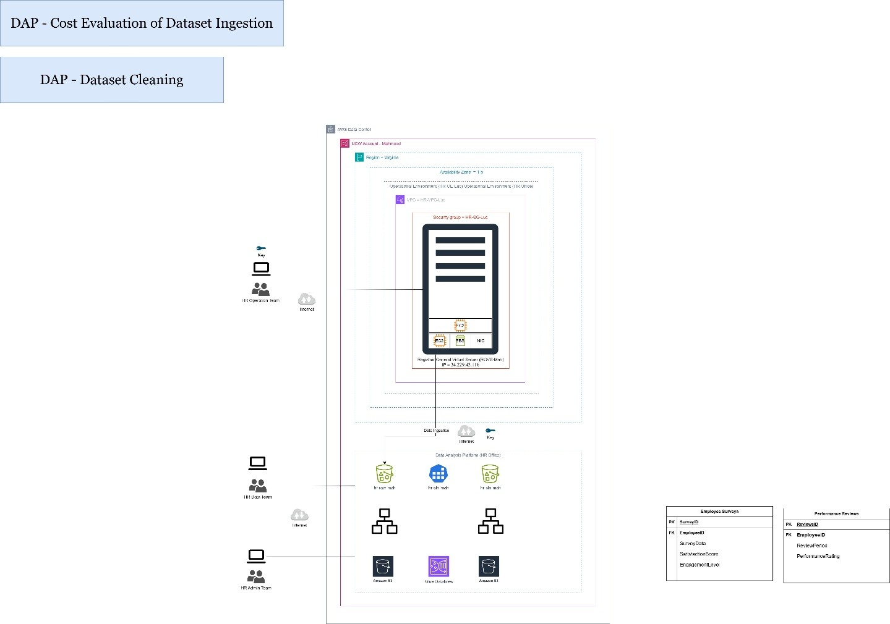

## HR Data Lake Solution on AWS

### Project Description
Implementation of a cloud-based data lake using AWS services to analyze factors influencing employee satisfaction and engagement within an HR department.

### Project Title
Design and Deployment of HR Data Lake Architecture using AWS

### Objective
The primary goal of this project was to analyze, design, and implement a data lake solution in AWS to address the business question provided by the HR operations team:  
**“What are the main factors impacting employee satisfaction and engagement?”**  
This project represents a scaled-down, functional version of the data lake solution that enables correlating employee sentiment with performance data, allowing better data-driven decisions.

### Business Question
What are the main factors impacting employee satisfaction and engagement?

### Dataset
The project utilized two main datasets provided by the HR operations team:

- **Employee Surveys**: Feedback from employees regarding their work experience, engagement, and satisfaction.
- **Performance Reviews**: Records of employee performance assessments conducted quarterly.

The datasets were provided in CSV and JSON formats with quarterly read/write frequency requirements.

### Methodology

#### 1. Analysis and Data Understanding
- Reviewed the business question and identified relevant datasets.
- Created a Fishbone Diagram to map potential causes of low employee satisfaction.

#### 2. Data Lake Design
- Standardized data formats into structured folders (CSV/JSON) within the data lake.
- Created an overall HR Data Lake architecture using AWS services.
- Designed the solution using:
  - AWS S3 for storage
  - EC2 for compute processing
  - EBS for storage
  - VPC for networking
  - Security Groups for access control

#### 3. Implementation
- Provisioned a custom VPC and Security Group to allow controlled access.
- Launched a Windows EC2 instance (t3.micro) for data processing operations.
- Configured Amazon S3 buckets with structured folders for each dataset.
- Implemented lifecycle policies to automatically transition infrequently accessed data to Glacier Instant Retrieval for cost optimization.

#### 4. Cost Optimization
- Enabled S3 lifecycle rules based on quarterly access patterns, significantly reducing long-term storage costs.

#### 5. Deployment Testing
- Successfully verified account setup, VPC, EC2 instance deployment, storage configurations, and lifecycle policies using AWS console and CLI commands.

### Tools and Technologies

- AWS S3, EC2, VPC, Security Groups, EBS, Glacier Instant Retrieval
- AWS CLI for provisioning resources
- Data formats: CSV, JSON
- Draw.io for architecture and analysis diagrams

### Deliverables

- A functioning AWS HR Data Lake prototype ready for further expansion (VPC, EC2, S3, Lifecycle policies).
- Architecture design diagrams and fishbone analysis to frame the business problem.
- Initial report documenting design, implementation, and validation steps.

### Summary
This project demonstrates the implementation of a scalable AWS data lake to support HR data analytics, enabling data-driven decisions to improve employee engagement and satisfaction.

---

## Cost Evaluation and Dataset Cleaning for HR Data Lake on AWS

### Project Description
This project focuses on the cost evaluation of dataset ingestion and the analysis, design, and implementation of the dataset cleaning process for an HR Data Lake on AWS. As a member of the HR data team, the objective was to optimize the ingestion pipeline and ensure data quality for further analytical tasks.

### Objective
The primary objective of this project was to evaluate the ingestion cost of HR datasets and to perform a comprehensive cleaning process to prepare the data for further analysis. The datasets involved were Employee Surveys and Performance Reviews. The project aimed to identify data quality issues, design appropriate cleaning strategies using AWS Glue DataBrew, and execute data cleansing while leveraging cloud services for scalability and automation.

### Dataset
The HR department provided two datasets critical for employee satisfaction and engagement analysis:

- **Employee Surveys (CSV format):** Collected feedback and responses from employees.
- **Performance Reviews (CSV format):** Contained employee evaluations and performance metrics.

### Methodology

#### 1. Cost Evaluation of Dataset Ingestion

- AWS Pricing Calculator was used to estimate ingestion costs based on:
  - Storage class: S3 Standard
  - Data volume: estimated object size and frequency (4 uploads per month)
  - **Result:** Monthly cost of $0.02 USD, totaling $6.01 USD for one year.

#### 2. Dataset Cleaning Analysis & Design

- Identified data issues such as:
  - Inconsistent schema (e.g., column name mismatches)
  - Duplicate records
- Cleaning strategies applied:
  - Standardized column names and data types
  - Removed duplicate rows
- Designed cleaning workflows for both datasets individually.

#### 3. Dataset Cleaning Implementation

- Implemented using AWS Glue DataBrew:
  - Standardized column names and data types.
  - Removed duplicate rows.
- Created separate S3 buckets for raw and cleaned data ("raw zone" and "cleaning zone").
- Executed Glue jobs to automate the cleaning pipelines.
- Cleaned datasets were stored in a structured format, ready for downstream analytics.

### Cloud Features Utilized

- Seamless integration between AWS services (S3, Glue, DataBrew).
- Automation of data preparation tasks.
- Scalability to handle growing datasets.
- Simplified orchestration of complex data workflows.

### Tools and Technologies

- AWS S3 for storage and ingestion
- AWS Pricing Calculator for cost estimation
- AWS Glue DataBrew for data cleaning and preparation
- AWS Pricing Calculator: Cost estimation
- Draw.io for design diagrams

### Deliverables

- Cost estimation report for dataset ingestion.
- Cleaning design diagrams.
- AWS Glue DataBrew projects for both datasets.
- Cleaned datasets stored in S3 Cleaning Zone.
- Visual documentation (attached diagrams from Draw.io).

### Conclusion
This project demonstrates the advantages of cloud computing for data management. By leveraging AWS services, complex tasks such as data ingestion, data cleaning, and storage organization were automated efficiently. The seamless integration between S3 and Glue DataBrew allowed for simplified data preparation and scalable storage management.

---