# Lucia Ceron - AWS Portfolio
Welcome to my AWS Portfolio! This collection showcases a series of cloud-based data analytics projects and case studies that I designed and implemented using real-world datasets and business questions. Each project demonstrates my ability to leverage AWS services to solve practical business challenges, from building data lakes and ETL pipelines to performing cost analysis and implementing secure, scalable cloud solutions. The portfolio also includes case studies that highlight my understanding of AWS deployment models, cost optimization, and best practices
- [Lucia Ceron - AWS Portfolio](#lucia-ceron---aws-portfolio)
  - [HR Data Lake Solution on AWS](#hr-data-lake-solution-on-aws)
    - [Project Description](#project-description)
    - [Project Title](#project-title)
    - [Objective](#objective)
    - [Business Question](#business-question)
    - [Dataset](#dataset)
    - [Methodology](#methodology)
      - [1. Analysis and Data Understanding](#1-analysis-and-data-understanding)
      - [2. Data Lake Design](#2-data-lake-design)
      - [3. Implementation](#3-implementation)
      - [4. Cost Optimization](#4-cost-optimization)
      - [5. Deployment Testing](#5-deployment-testing)
    - [Tools and Technologies](#tools-and-technologies)
    - [Deliverables](#deliverables)
    - [Summary](#summary)
  - [Cost Evaluation and Dataset Cleaning for HR Data Lake on AWS](#cost-evaluation-and-dataset-cleaning-for-hr-data-lake-on-aws)
    - [Project Description](#project-description-1)
    - [Objective](#objective-1)
    - [Dataset](#dataset-1)
    - [Methodology](#methodology-1)
      - [1. Cost Evaluation of Dataset Ingestion](#1-cost-evaluation-of-dataset-ingestion)
      - [2. Dataset Cleaning Analysis \& Design](#2-dataset-cleaning-analysis--design)
      - [3. Dataset Cleaning Implementation](#3-dataset-cleaning-implementation)
    - [Cloud Features Utilized](#cloud-features-utilized)
    - [Tools and Technologies](#tools-and-technologies-1)
    - [Deliverables](#deliverables-1)
    - [Conclusion](#conclusion)
  - [Employee Satisfaction and Engagement Analysis using AWS Cloud Services](#employee-satisfaction-and-engagement-analysis-using-aws-cloud-services)
    - [Project Description](#project-description-2)
    - [Objective](#objective-2)
    - [Dataset](#dataset-2)
    - [Methodology](#methodology-2)
      - [1. Data Collection and Preparation](#1-data-collection-and-preparation)
      - [2. Cost Evaluation and Monitoring](#2-cost-evaluation-and-monitoring)
      - [3. ETL Design](#3-etl-design)
      - [4. ETL Implementation](#4-etl-implementation)
    - [Tools and Technologies](#tools-and-technologies-2)
    - [Deliverables](#deliverables-2)
  - [Cloud Data Lake Ingestion for HR Business Questions: A DAP Approach](#cloud-data-lake-ingestion-for-hr-business-questions-a-dap-approach)
    - [Project Description](#project-description-3)
    - [Objective](#objective-3)
    - [Dataset](#dataset-3)
    - [Methodology](#methodology-3)
      - [1. Analysis of Operational Environment](#1-analysis-of-operational-environment)
      - [2. Root Cause Analysis](#2-root-cause-analysis)
      - [3. Solution Architecture Design](#3-solution-architecture-design)
      - [4. Implementation](#4-implementation)
    - [Tools and Technologies](#tools-and-technologies-3)
    - [Deliverables](#deliverables-3)
  - [AWS Data Analytic Platform for The City of Vancouver](#aws-data-analytic-platform-for-the-city-of-vancouver)
    - [Project Title: Migration and Descriptive Analysis of Cultural Spaces Data for The City of Vancouver](#project-title-migration-and-descriptive-analysis-of-cultural-spaces-data-for-the-city-of-vancouver)
    - [Objective:](#objective-4)
    - [Dataset:](#dataset-4)
    - [Methodology:](#methodology-4)
      - [1. Data Collection and Preparation:](#1-data-collection-and-preparation-1)
      - [2. Data Profiling:](#2-data-profiling)
      - [3. Data Cleaning:](#3-data-cleaning)
      - [4. Data Cataloging:](#4-data-cataloging)
      - [5. Data Summarization:](#5-data-summarization)
    - [Insights and Findings:](#insights-and-findings)
    - [Recommendations:](#recommendations)
    - [Tools and Technologies:](#tools-and-technologies-4)
    - [Deliverables:](#deliverables-4)
  - [Secure Cloud Data Platform with Governance and Monitoring for City of Vancouver](#secure-cloud-data-platform-with-governance-and-monitoring-for-city-of-vancouver)
    - [Cloud Migration and Data Governance for Cultural Spaces Dataset - City of Vancouver](#cloud-migration-and-data-governance-for-cultural-spaces-dataset---city-of-vancouver)
      - [Objective](#objective-5)
      - [Dataset](#dataset-5)
      - [Methodology](#methodology-5)
        - [1. Data Collection and Preparation](#1-data-collection-and-preparation-2)
        - [2. Data Governance](#2-data-governance)
        - [3. Data Monitoring](#3-data-monitoring)
      - [Tools and Technologies](#tools-and-technologies-5)
      - [Deliverables](#deliverables-5)
  - [AWS Deployment and Service Models](#aws-deployment-and-service-models)
    - [Case Study 1: Traditional Computing Model vs Cloud Computing Model](#case-study-1-traditional-computing-model-vs-cloud-computing-model)
    - [Case Study 2: Cloud Deployment Models](#case-study-2-cloud-deployment-models)
    - [Case Study 3: Cloud Service Models](#case-study-3-cloud-service-models)
  - [AWS Cost Analysis](#aws-cost-analysis)
    - [Case Study 4: Total Cost of Ownership — Delaware North](#case-study-4-total-cost-of-ownership--delaware-north)
    - [Case Study 5: AWS Support Plans](#case-study-5-aws-support-plans)
    - [Case Study 6: AWS Support Plans](#case-study-6-aws-support-plans)
  - [AWS Global infrastructure](#aws-global-infrastructure)
  - [AWS IAM](#aws-iam)
    - [(Case #8) Who is Responsible](#case-8-who-is-responsible)
    - [IAM Practice Lab 1](#iam-practice-lab-1)
  - [AWS VPC](#aws-vpc)
  - [AWS Lambda](#aws-lambda)
  - [AWS EBS](#aws-ebs)

## HR Data Lake Solution on AWS

### Project Description
Implementation of a cloud-based data lake using AWS services to analyze factors influencing employee satisfaction and engagement within an HR department.

### Project Title
Design and Deployment of HR Data Lake Architecture using AWS

### Objective
The primary goal of this project was to analyze, design, and implement a data lake solution in AWS to address the business question provided by the HR operations team:  
**“What are the main factors impacting employee satisfaction and engagement?”**  
This project represents a scaled-down, functional version of the data lake solution that enables correlating employee sentiment with performance data, allowing better data-driven decisions.

### Business Question
What are the main factors impacting employee satisfaction and engagement?

### Dataset
The project utilized two main datasets provided by the HR operations team:

- **Employee Surveys**: Feedback from employees regarding their work experience, engagement, and satisfaction.
- **Performance Reviews**: Records of employee performance assessments conducted quarterly.

The datasets were provided in CSV and JSON formats with quarterly read/write frequency requirements.

### Methodology

#### 1. Analysis and Data Understanding
- Reviewed the business question and identified relevant datasets.
- Created a Fishbone Diagram to map potential causes of low employee satisfaction.

#### 2. Data Lake Design
- Standardized data formats into structured folders (CSV/JSON) within the data lake.
- Created an overall HR Data Lake architecture using AWS services.
- Designed the solution using:
  - AWS S3 for storage
  - EC2 for compute processing
  - EBS for storage
  - VPC for networking
  - Security Groups for access control

#### 3. Implementation
- Provisioned a custom VPC and Security Group to allow controlled access.
- Launched a Windows EC2 instance (t3.micro) for data processing operations.
- Configured Amazon S3 buckets with structured folders for each dataset.
- Implemented lifecycle policies to automatically transition infrequently accessed data to Glacier Instant Retrieval for cost optimization.

#### 4. Cost Optimization
- Enabled S3 lifecycle rules based on quarterly access patterns, significantly reducing long-term storage costs.

#### 5. Deployment Testing
- Successfully verified account setup, VPC, EC2 instance deployment, storage configurations, and lifecycle policies using AWS console and CLI commands.

### Tools and Technologies

- AWS S3, EC2, VPC, Security Groups, EBS, Glacier Instant Retrieval
- AWS CLI for provisioning resources
- Data formats: CSV, JSON
- Draw.io for architecture and analysis diagrams

### Deliverables

- A functioning AWS HR Data Lake prototype ready for further expansion (VPC, EC2, S3, Lifecycle policies).
- Architecture design diagrams and fishbone analysis to frame the business problem.
- Initial report documenting design, implementation, and validation steps.

### Summary
This project demonstrates the implementation of a scalable AWS data lake to support HR data analytics, enabling data-driven decisions to improve employee engagement and satisfaction.

---

## Cost Evaluation and Dataset Cleaning for HR Data Lake on AWS

### Project Description
This project focuses on the cost evaluation of dataset ingestion and the analysis, design, and implementation of the dataset cleaning process for an HR Data Lake on AWS. As a member of the HR data team, the objective was to optimize the ingestion pipeline and ensure data quality for further analytical tasks.

### Objective
The primary objective of this project was to evaluate the ingestion cost of HR datasets and to perform a comprehensive cleaning process to prepare the data for further analysis. The datasets involved were Employee Surveys and Performance Reviews. The project aimed to identify data quality issues, design appropriate cleaning strategies using AWS Glue DataBrew, and execute data cleansing while leveraging cloud services for scalability and automation.

### Dataset
The HR department provided two datasets critical for employee satisfaction and engagement analysis:

- **Employee Surveys (CSV format):** Collected feedback and responses from employees.
- **Performance Reviews (CSV format):** Contained employee evaluations and performance metrics.

### Methodology

#### 1. Cost Evaluation of Dataset Ingestion

- AWS Pricing Calculator was used to estimate ingestion costs based on:
  - Storage class: S3 Standard
  - Data volume: estimated object size and frequency (4 uploads per month)
  - **Result:** Monthly cost of $0.02 USD, totaling $6.01 USD for one year.

#### 2. Dataset Cleaning Analysis & Design

- Identified data issues such as:
  - Inconsistent schema (e.g., column name mismatches)
  - Duplicate records
- Cleaning strategies applied:
  - Standardized column names and data types
  - Removed duplicate rows
- Designed cleaning workflows for both datasets individually.

#### 3. Dataset Cleaning Implementation

- Implemented using AWS Glue DataBrew:
  - Standardized column names and data types.
  - Removed duplicate rows.
- Created separate S3 buckets for raw and cleaned data ("raw zone" and "cleaning zone").
- Executed Glue jobs to automate the cleaning pipelines.
- Cleaned datasets were stored in a structured format, ready for downstream analytics.

### Cloud Features Utilized

- Seamless integration between AWS services (S3, Glue, DataBrew).
- Automation of data preparation tasks.
- Scalability to handle growing datasets.
- Simplified orchestration of complex data workflows.

### Tools and Technologies

- AWS S3 for storage and ingestion
- AWS Pricing Calculator for cost estimation
- AWS Glue DataBrew for data cleaning and preparation
- AWS Pricing Calculator: Cost estimation
- Draw.io for design diagrams

### Deliverables

- Cost estimation report for dataset ingestion.
- Cleaning design diagrams.
- AWS Glue DataBrew projects for both datasets.
- Cleaned datasets stored in S3 Cleaning Zone.
- Visual documentation (attached diagrams from Draw.io).

### Conclusion
This project demonstrates the advantages of cloud computing for data management. By leveraging AWS services, complex tasks such as data ingestion, data cleaning, and storage organization were automated efficiently. The seamless integration between S3 and Glue DataBrew allowed for simplified data preparation and scalable storage management.

---

## Employee Satisfaction and Engagement Analysis using AWS Cloud Services

### Project Description

The project aimed to analyze employee satisfaction and performance metrics by designing and implementing a data analytics pipeline within the AWS ecosystem. This involved transforming raw HR datasets into a reliable Single Source of Truth (SST) to support descriptive, diagnostic, and prescriptive analysis aligned with business objectives.

### Objective

The primary objective was to analyze, design, implement, and evaluate a data pipeline solution to address the business question:

*"What are the main factors impacting employee satisfaction and engagement?"*

Through descriptive, diagnostic, and prescriptive analysis, the project aimed to provide reliable metrics to support HR decision-making.

### Dataset

The project utilized two key datasets provided by the HR Operations team:

- **Employee Surveys:** capturing employee satisfaction, engagement, and qualitative feedback.
- **Performance Reviews:** including employee evaluations, performance scores, and engagement records.

Both datasets were delivered in CSV, with a quarterly update frequency.

### Methodology

#### 1. Data Collection and Preparation

- Received datasets from HR team.
- Loaded datasets into AWS S3.
- Conducted data profiling and cleaning using AWS Glue DataBrew to address datatype inconsistencies and detailed record issues.

#### 2. Cost Evaluation and Monitoring

- Utilized AWS Pricing Calculator to estimate monthly and annual costs for data profiling and cleaning operations in AWS Glue, ensuring cost-efficiency.
- Configured AWS CloudWatch alarms to monitor estimated costs and maintain budget control.

#### 3. ETL Design

- Designed an ETL (Extract, Transform, Load) process aligned with business questions.
- Joined datasets using an inner join on EmployeeID.
- Defined SQL transformations to calculate metrics such as:
  - Average satisfaction per quarter.
  - Engagement levels.
  - Evaluation completion rates.
- The integrated data was structured into a Single Source of Truth (SST), ensuring consistency, availability, and reliability for HR analytics.

#### 4. ETL Implementation

- Developed the ETL flow in AWS Glue Studio applying SQL-based transformations.
- Stored processed data in S3 (Parquet format).
- Registered datasets in the AWS Glue Data Catalog for accessibility through AWS Athena.
- Enabled querying for key HR metrics and allowed ongoing evaluation.

### Tools and Technologies

- AWS Glue (DataBrew, Studio, Data Catalog)
- AWS Athena
- AWS S3
- AWS Pricing Calculator
- AWS CloudWatch
- SQL

### Deliverables

- A fully automated ETL pipeline for HR data.
- Cost-effective architecture with continuous monitoring.
- Key metrics and insights supporting HR strategic decisions.
- Cost evaluation report.
- Visual diagrams of data architecture and ETL flow.
- Analytical outputs accessible via Athena for real-time HR decision support.

---

## Cloud Data Lake Ingestion for HR Business Questions: A DAP Approach

### Project Description
This project focuses on analyzing, designing, and implementing a data lake solution to support the HR department in addressing the business question: "What are the factors influencing employee satisfaction and engagement?" The solution involved understanding the operational environment, analyzing data lineage, designing data processing pipelines, and implementing the initial ingestion phase in the cloud.

### Objective
The primary goal of this project was to create a foundational cloud-based data architecture that allows HR analysts to ingest, store, and prepare datasets for future analysis of employee satisfaction drivers. The work was focused on analyzing the existing environment, identifying data sources, and building a data ingestion solution using AWS S3.

### Dataset
The datasets provided by the HR operations team included:
- Employee Surveys
- Performance Reviews

These datasets contain information relevant to employee sentiment, engagement levels, and performance outcomes.

### Methodology

#### 1. Analysis of Operational Environment
- Identified data sources, storage locations, processing units, and system interactions.
- Conducted a dataset lineage analysis to map data generation, storage, processing, and access permissions.

#### 2. Root Cause Analysis
- Created a Fishbone diagram to visualize potential causes affecting employee satisfaction.

#### 3. Solution Architecture Design
- Proposed a Data Architecture Plan (DAP) with the following components:
  - Data Lake design on AWS S3 for initial storage.
  - Data Cleaning strategies to address data quality issues.
  - ETL Design transforming business questions into actionable data queries.
  - Data Enrichment plans to enhance dataset value.
  - Data Summarization structures to support decision-making.

#### 4. Implementation
- Created a Raw Bucket in AWS S3 cloud service for initial dataset ingestion.
- This step laid the foundation for the future ETL and analytics workflows.

### Tools and Technologies
- AWS S3 (Cloud Storage)
- Data Architecture Planning (DAP)
- draw.io (for architecture and process diagrams)

### Deliverables
- Full analysis of operational environment and dataset lineage.
- Root cause diagram to understand employee satisfaction factors.
- Solution architecture diagrams for ingestion, cleaning, transformation, enrichment, and summarization phases.
- Cloud implementation of dataset ingestion in AWS S3 Raw Bucket.

This project demonstrates the initial steps in building a scalable cloud-based data lake architecture to support advanced HR analytics and employee engagement insights.

---

## AWS Data Analytic Platform for The City of Vancouver

### Project Title: Migration and Descriptive Analysis of Cultural Spaces Data for The City of Vancouver

### Objective:

The objective of this project is to design, implement, and deploy a cloud-based data analytic platform (DAP) for the City of Vancouver using AWS services. The platform enables descriptive analysis on the 'Cultural Spaces' dataset, focusing on analyzing trends in average square footage by ownership type and the distribution of cultural space types over time. The final goal is to assist city officials in decision-making and resource allocation.

### Dataset:

The dataset was sourced from the City of Vancouver's open data portal, specifically selecting the "Cultural Spaces" dataset, which includes:

* Cultural Space Name
* Type of Cultural Space (e.g., Café/Restaurant/Bar, Museum, Education)
* Primary Cultural Use
* Square Footage
* Ownership Type (Private, Non-profit, Government)
* Geo Coordinates
* Year of data collection: 2014, 2015, 2016, 2017, 2020
* Record Count: Initially 1,942 records; filtered to 472 records for Downtown Vancouver

### Methodology:

#### 1. Data Collection and Preparation:

* Downloaded the dataset as CSV from the City of Vancouver official portal.
* Applied geographic filtering to retain only records for Downtown Vancouver to optimize AWS storage costs.
* Designed the raw data ingestion structure in S3: `s3://cs-raw-luc/cs/Cultural_Spaces/year=20/CSV/cultural-spaces.csv`
* Uploaded raw data into the S3 bucket `cs-raw-luc`.

#### 2. Data Profiling:

* Executed data profiling using AWS Glue DataBrew.
* Identified key data issues:

  * 13% missing 'website' values.
  * 38% missing 'square feet' values.
  * 80% missing 'number of seats' values.
  * 'Active Space' and geo fields were deemed unnecessary.
* Created profiling job outputs into `s3://cs-cln-luc/Cultural_Spaces/`.

#### 3. Data Cleaning:

* Developed a cleaning recipe in AWS Glue DataBrew including:

  * Replacing inconsistent text values in 'TYPE' and 'PRIMARY\_USE' columns.
  * Dropping non-informative columns ('Active Space', 'Geom', 'GeoPoint2D').
  * Deleting rows with missing 'OWNERSHIP' values.
* Stored cleaned data into `s3://cs-cln-luc` and created partitions based on 'Ownership'.

#### 4. Data Cataloging:

* Created an AWS Glue Data Catalog `cs-data-catalog-luc`.
* Used crawlers to automatically populate schema definitions from cleaned datasets.
* Configured ETL processes to enrich data:

  * Added 'Current Timestamp' column.
  * Dropped 'Number of Seats' due to high missingness.
* Stored curated datasets into `s3://cs-cur-luc`.

#### 5. Data Summarization:

* Conducted SQL-based analysis using AWS Athena:

  * Metric 1: Average Square Foot by Ownership (`avg_sqft_by_ownership`)
  * Metric 2: Count of Cultural Spaces by Type (`num_cultural_spaces_by_type`)
* Generated insights on ownership trends and cultural space type distributions.

### Insights and Findings:

* Private ownership of cultural spaces showed consistent growth in average square footage between 2014 and 2020.
* Government and City-owned cultural spaces declined in average square footage.
* 'Café/Restaurant/Bar' type cultural spaces increased, while 'Museums' showed a downward trend.

### Recommendations:

* Consider policy support for declining public and government cultural spaces.
* Promote investment opportunities in growing sectors like Café/Restaurant/Bar to align with emerging cultural trends.
* Regular data updates can help maintain ongoing monitoring for city planning.

### Tools and Technologies:

* AWS S3 (Storage & Data Lake Management)
* AWS Glue DataBrew (Profiling & Cleaning)
* AWS Glue Data Catalog (Metadata Management)
* AWS Glue ETL (Data Transformation)
* AWS Athena (Querying & Analysis)

### Deliverables:

* Fully functional AWS Data Analytic Platform for Cultural Spaces.
* Cleaned, curated datasets with enriched schema.
* SQL-based dashboards generated via AWS Athena.
* Visual designs and architecture diagrams (to be attached from draw\.io) demonstrating full workflow.

This project demonstrates end-to-end implementation of a cloud-based data analytics pipeline using AWS services, enabling public sector data-driven decision making.

---

## Secure Cloud Data Platform with Governance and Monitoring for City of Vancouver

### Cloud Migration and Data Governance for Cultural Spaces Dataset - City of Vancouver

#### Objective
The objective of this project was to design and implement a Data Analytics Platform (DAP) on AWS to support the City of Vancouver's migration requirements. The project specifically focused on securely migrating the "Cultural Spaces" dataset, ensuring data governance, quality, monitoring, and resilience in alignment with municipal compliance and operational standards.

#### Dataset
The dataset used for this project was the City of Vancouver's "Cultural Spaces" dataset, containing information about cultural venues within the city. The dataset included the following key features:
- Cultural Space Name
- Year
- Type
- Primary Use
- Other related metadata fields necessary for analytics

#### Methodology

##### 1. Data Collection and Preparation
- The original Cultural Spaces dataset was ingested into Amazon S3 bucket named `cs-raw-luc`.
- Implemented encryption using AWS KMS with a customer managed symmetric key to ensure full control over data encryption and compliance.
- Enabled bucket versioning to support recovery and resilience.
- Established replication rules to backup data into separate replica buckets (e.g., `cs-raw-bac-luc`).

##### 2. Data Governance
- Created an ETL pipeline incorporating AWS Glue and the "Evaluate Data Quality" node.
- Defined data quality rules to evaluate completeness and uniqueness, including:
  - Completeness (Cultural Space Name) >= 90%
  - Uniqueness (Cultural Space Name) >= 80%
  - Completeness (Year) > 99%
  - Completeness (Type) >= 95%
  - Completeness (Primary Use) > 99%
- Configured ETL jobs to route validated records to `cs-cln-luc/Quality_Check/Passed` and invalid records to `cs-cln-luc/Quality_Check/Failed` for further review.

##### 3. Data Monitoring
- Configured AWS CloudWatch dashboards to monitor:
  - S3 bucket sizes over time
  - Resource usage by ETL pipelines
  - AWS service estimated charges
- Set up CloudWatch alarms to send email notifications when defined thresholds for resource usage or costs are exceeded.
- Enabled AWS CloudTrail for system-wide logging and audit trails to track activity and support debugging.

#### Tools and Technologies
- AWS S3 (Storage, Replication, Versioning)
- AWS KMS (Key Management Service)
- AWS Glue (ETL, Data Quality Evaluation)
- AWS CloudWatch (Dashboards, Alarms)
- AWS CloudTrail (Activity Logging)

#### Deliverables
- Fully operational Data Analytics Platform in AWS for the City of Vancouver.
- Secure, encrypted, and versioned data storage with automated backup replication.
- Implemented data quality evaluation pipeline with clear segregation of passed and failed records.
- Comprehensive monitoring dashboards and automated alarms for resource and cost monitoring.
- Complete audit trail of system activities via CloudTrail logs.

This project demonstrates secure cloud data migration, effective data governance practices, and proactive monitoring solutions, providing the City of Vancouver with a resilient and compliant data analytics infrastructure.

---

## AWS Deployment and Service Models

### Case Study 1: Traditional Computing Model vs Cloud Computing Model

**Explanation of Results:**  
In this case study, I compared traditional on-premises IT infrastructure with cloud computing. Traditional models require significant capital investment, manual hardware management, and ongoing maintenance. In contrast, AWS cloud computing offers on-demand scalability, consumption-based pricing, and fully managed services. This analysis demonstrated how cloud computing allows organizations to optimize costs, increase agility, and focus on business innovation rather than infrastructure management.

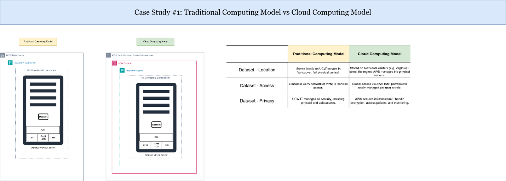

### Case Study 2: Cloud Deployment Models

**Explanation of Results:**  
I analyzed the different AWS cloud deployment models:
- **Public Cloud** (fully hosted by AWS, multi-tenant model)
- **Private Cloud** (dedicated cloud resources for a single organization)
- **Hybrid Cloud** (combines on-premises infrastructure with cloud resources)

For my projects, I implemented a **Public Cloud** deployment where all services were provisioned directly within AWS. This provided simplicity, scalability, and cost efficiency without needing any on-premise infrastructure.

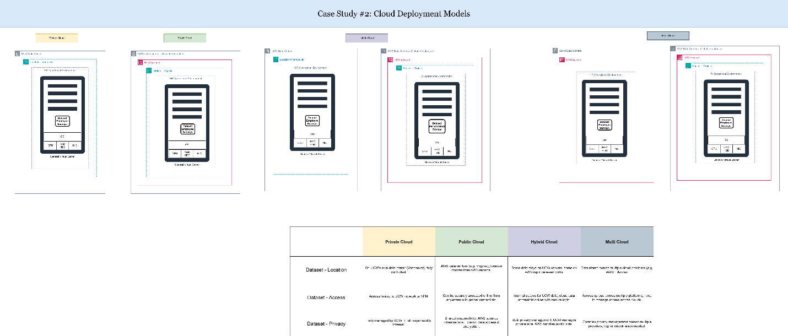

### Case Study 3: Cloud Service Models

**Explanation of Results:**  
This case study focused on understanding the different AWS service models:
- **IaaS (Infrastructure-as-a-Service):** Amazon EC2, Amazon EBS, VPC
- **PaaS (Platform-as-a-Service):** AWS Glue, AWS Glue DataBrew
- **SaaS (Software-as-a-Service):** AWS Pricing Calculator, AWS CloudWatch

My projects used a combination of these models to build scalable data pipelines and analytics platforms fully managed in AWS, showcasing how service model selection supports flexible architecture design.

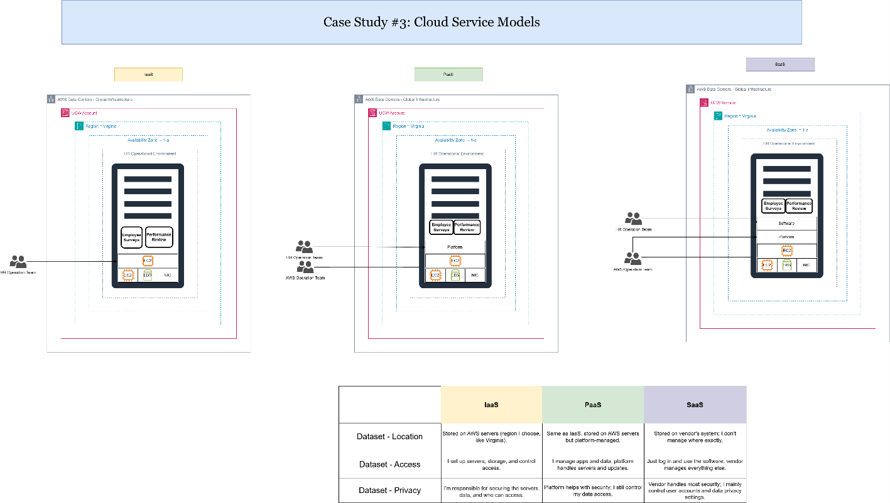

---

## AWS Cost Analysis

### Case Study 4: Total Cost of Ownership — Delaware North

**Explanation of Results:**  
I analyzed the Delaware North case where migrating to AWS significantly reduced total infrastructure costs. The shift from capital-intensive on-premise hardware to flexible cloud services resulted in operational cost savings, resource optimization, and scalability. This case highlighted the financial advantages of cloud migration based on AWS's Total Cost of Ownership (TCO) framework.

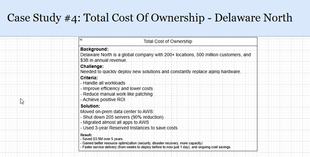

### Case Study 5: AWS Support Plans

**Explanation of Results:**  
Using AWS Pricing Calculator, I estimated projected costs for my data lake projects. For example, HR dataset ingestion was calculated at approximately $6.01 USD annually based on S3 storage with quarterly uploads. This tool enabled me to forecast costs accurately, assess financial feasibility, and plan resource usage effectively before deployment.

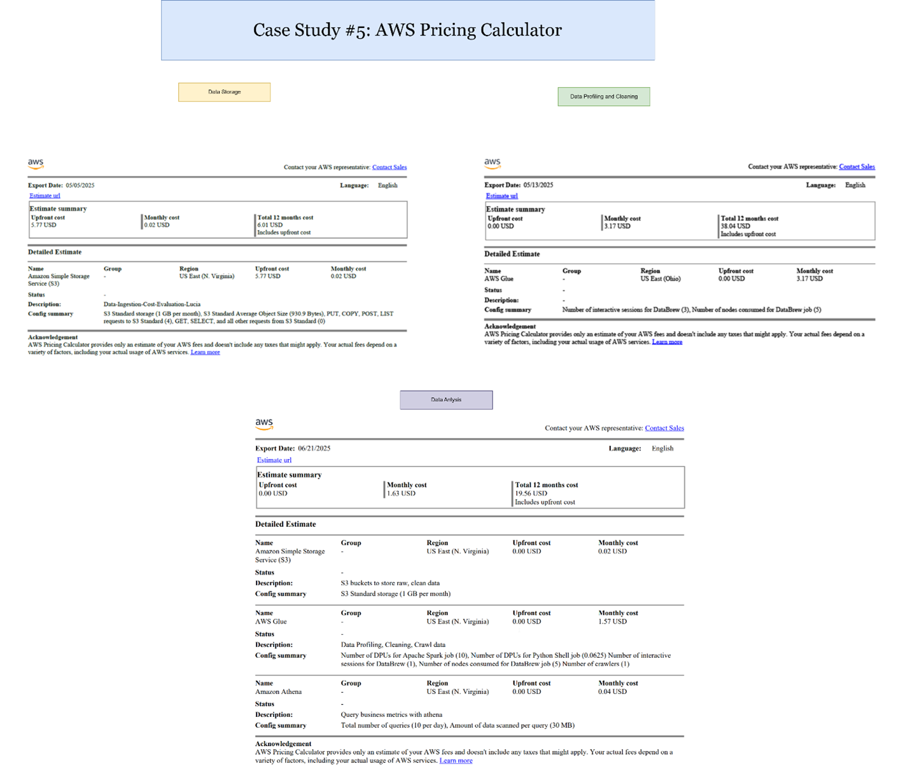

### Case Study 6: AWS Support Plans

**Explanation of Results:**  
I reviewed AWS Support Plan options: Basic, Developer, Business, and Enterprise. For production workloads, the Business Support Plan would provide 24/7 technical support, faster response times, infrastructure event management, and architectural guidance. This evaluation showed how selecting appropriate support levels can ensure operational continuity and effective issue resolution.

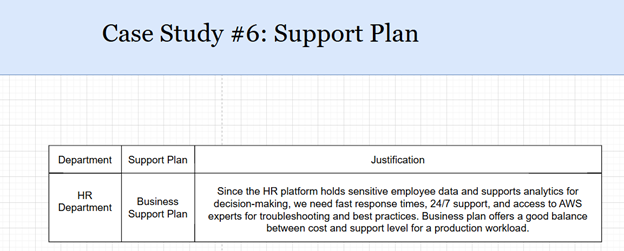

---

## AWS Global infrastructure 

**Explanation of Results:**

The project was deployed in the us-east-1 (N. Virginia) AWS region, leveraging AWS's global infrastructure for high availability and resilience. This region provided multiple Availability Zones for fault tolerance, low-latency resource access, and geographic redundancy. This case study demonstrated how AWS’s global infrastructure supports business continuity, disaster recovery, and scalability.

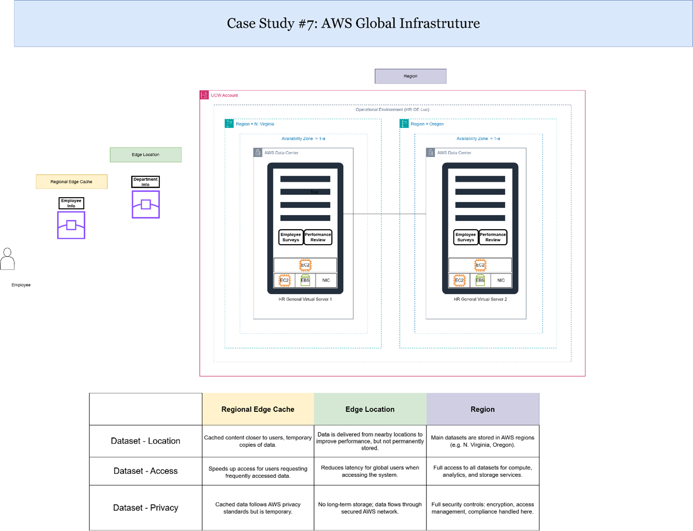

---

## AWS IAM 

### (Case #8) Who is Responsible
**Explanation of Results:**

I analyzed AWS’s Shared Responsibility Model, which divides security responsibilities:
-	AWS is responsible for security of the cloud (physical infrastructure, global network, hardware).
-	Customers are responsible for security in the cloud (data protection, access management, identity governance).
This understanding is crucial for correctly configuring IAM policies and securing workloads on AWS.

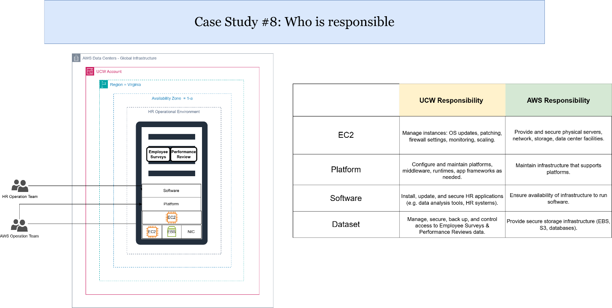

### IAM Practice Lab 1
**Explanation of Results:**

Through hands-on lab exercises, I configured IAM users, groups, and roles with custom policies. I applied the principle of least privilege, granting users only necessary access permissions. These practical tasks demonstrated how IAM controls secure resource access, prevent unauthorized actions, and support compliance within cloud environments.

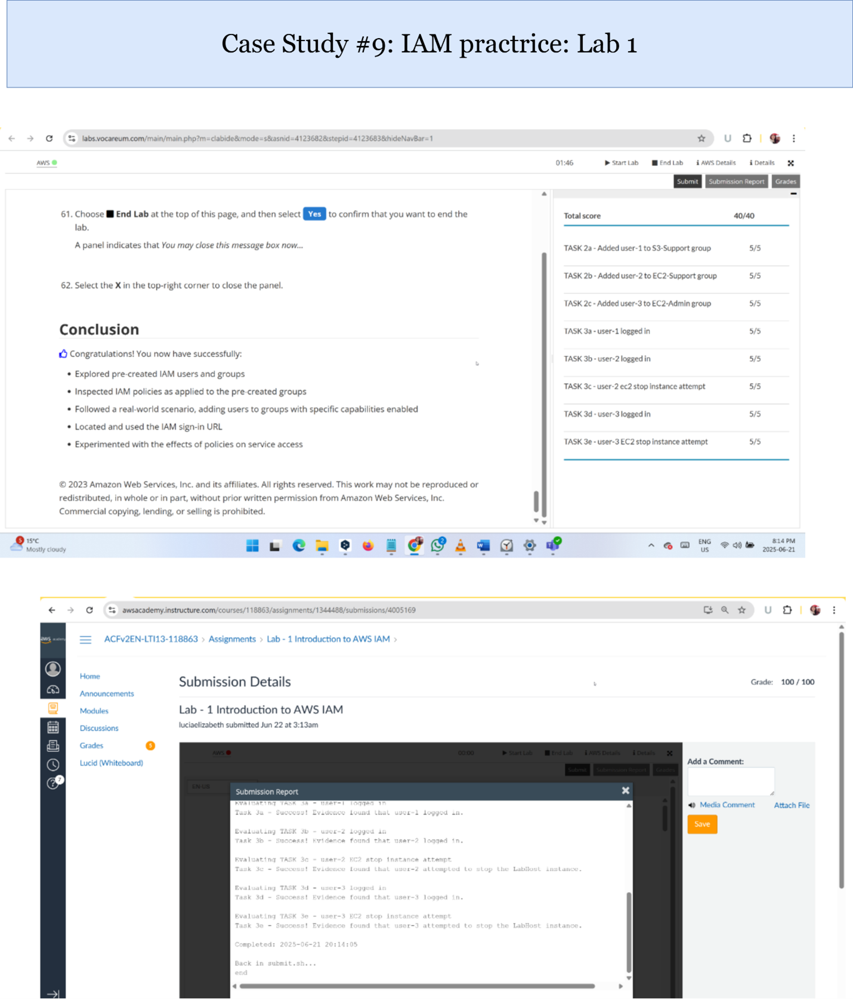

---

## AWS VPC
**Explanation of Results:**

In this lab activity, I designed a custom Virtual Private Cloud (VPC) with public and private subnets, route tables, internet gateways, and security groups. EC2 instances were deployed inside the VPC to simulate secure cloud networking. This exercise provided valuable experience in network isolation, controlled traffic flows, and the foundational principles of secure VPC design for cloud environments.

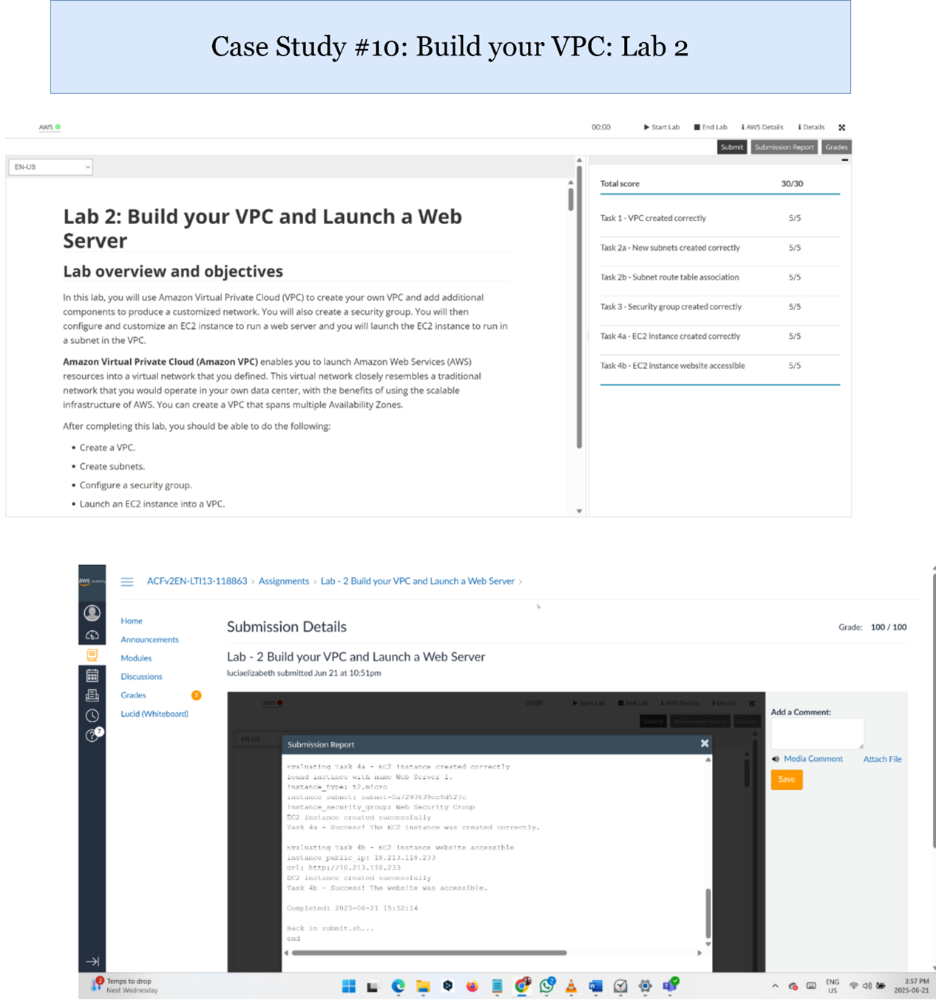

---

## AWS Lambda 
**Explanation of Results:**

AWS Lambda was explored through lab activities where I created serverless functions triggered by S3 events. These functions automated simple tasks such as generating notifications and processing file uploads. This exercise introduced me to event-driven computing, serverless architecture benefits, and integration with CloudWatch for monitoring Lambda executions.

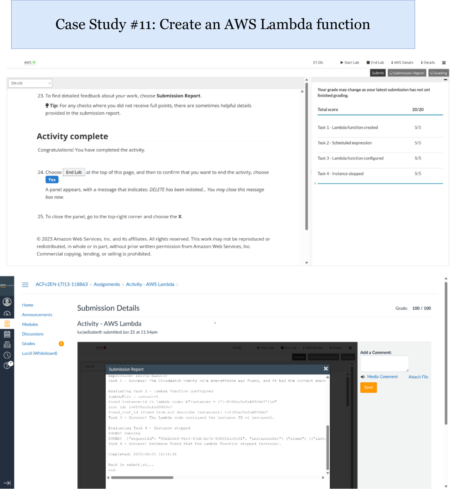

---

## AWS EBS
**Explanation of Results:**

Amazon Elastic Block Store (EBS) volumes were attached to EC2 instances to provide persistent storage during data processing tasks. EBS offered scalable storage performance with snapshot capabilities for backup and recovery. These activities demonstrated how EBS supports compute workloads requiring durable, high-performance storage in cloud environments

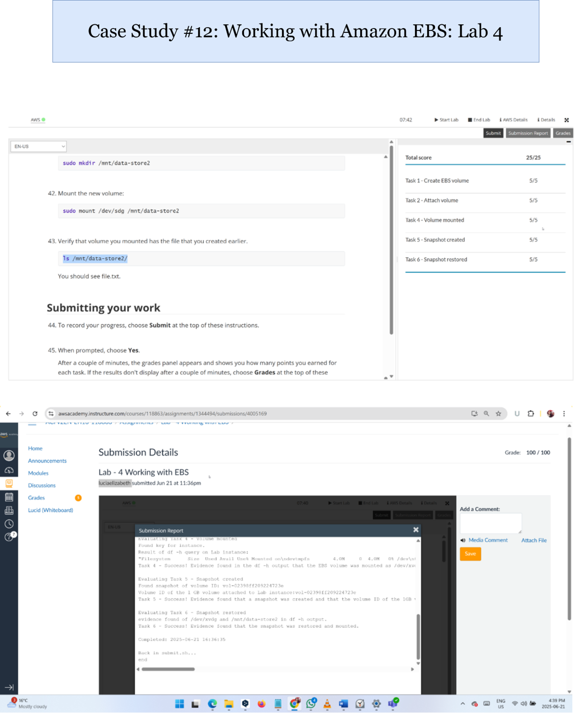 
